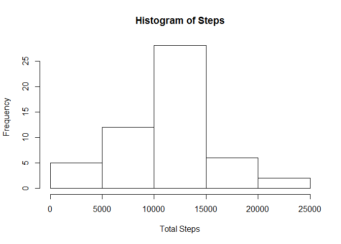
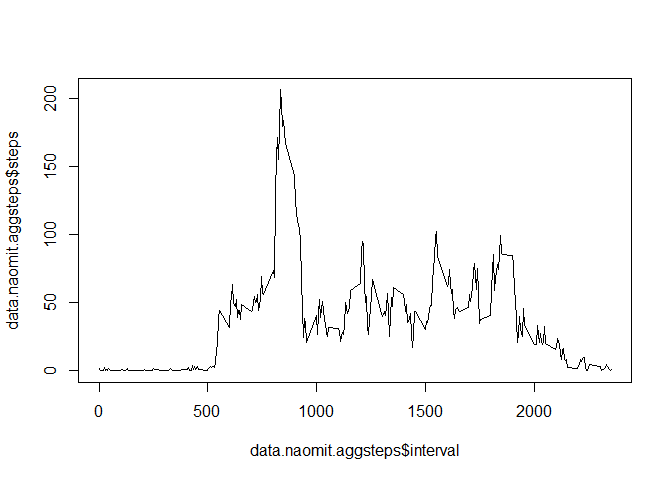
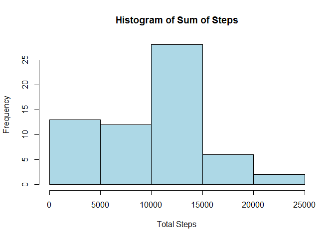
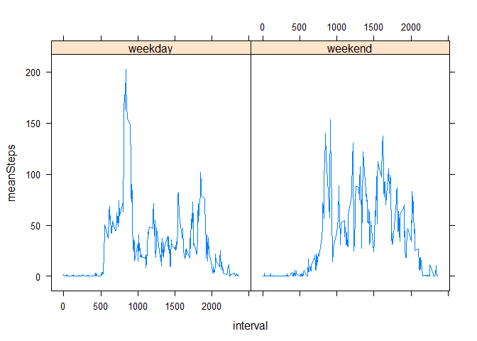

# Reproducible Research: Peer Assessment 1


## Loading and preprocessing the data

```r
#create a temporary directory
td <- tempdir()
# create the placeholder file
tf <- tempfile(tmpdir=td, fileext=".zip")
# download into the placeholder file
download.file("http://d396qusza40orc.cloudfront.net/repdata%2Fdata%2Factivity.zip", tf, mode="wb")
# get the name of the first file in the zip archive
fname <- unzip(tf, list=TRUE)$Name[1]
# unzip the file to the temporary directory
unzip(tf, files=fname, exdir=td, overwrite=TRUE)
# fpath is the full path to the extracted file
filepath = file.path(td, fname)
# stringsAsFactors=TRUE will screw up conversion to numeric!
data <- read.csv(filepath, header=TRUE, row.names=NULL, 
                 stringsAsFactors=FALSE, na.strings = "NA")
#omit rows where steps are NA and stored in a new variable data.naomit
data.naomit <- na.omit(data)
```
## What is mean total number of steps taken per day?

```r
#Make a histogram of the total number of steps taken each daynaomit <- na.omit(data)
data.naomit.totsteps<- aggregate(steps ~ date, data.naomit, sum)
hist(data.naomit.totsteps$steps, main="Histogram of Steps",xlab="Total Steps")
```

 

```r
# load data.table library
library(data.table)
```

```
## Warning: package 'data.table' was built under R version 3.1.2
```

```r
#Calculate and report the mean and median total number of steps taken per day
data.table(median=median(data.naomit$steps),mean=mean(data.naomit$steps))
```

```
##    median    mean
## 1:      0 37.3826
```
## What is the average daily activity pattern?

```r
#Average daily activity pattern?
library(plyr)
#calculate the mean for the 5-minute interval average number of steps taken across all days
data.naomit.aggsteps <- aggregate(steps ~ interval, data.naomit, mean)
# creating time serie plot
plot(data.naomit.aggsteps$interval, data.naomit.aggsteps$steps,type = "l")
```

 

```r
#Which 5-minute interval, on average across all the days in the dataset, contains the maximum number of steps?
which.max(data.naomit.aggsteps$interval)
```

```
## [1] 288
```
## Imputing missing values

```r
# count missing values
nbNa <-sum(is.na(data$steps))
#Strategy for filling in all of the missing values in the dataset.
# Create a new dataset that is equal to the original dataset but with the missing data filled in.
data.copy <-data
# 5-minute interval average number of steps taken across all days
data.copy[is.na(data.copy)] <- mean(data.naomit$steps)/nrow(data.naomit.aggsteps) #Nb of observations of average data every 5 minutes
#calculate the sum of steps
data.copy.sumdata <- ddply(data.copy, .(date), summarize, sumSteps = sum(steps, na.rm = TRUE))
#Make a histogram of the total number of steps taken each days 
hist(data.copy.sumdata$sumSteps, main="Histogram of Sum of Steps",xlab="Total Steps", col="lightblue")
```

 

```r
library(data.table)
#Calculate and report the mean and median total number of step
data.table(median=median(data.copy$steps),mean=mean(data.copy$steps))
```

```
##    median     mean
## 1:      0 32.49699
```
## Are there differences in activity patterns between weekdays and weekends?

```r
#Create a new factor variable in the dataset with two levels - "weekday" and "weekend" indicating whether a given date is a weekday or weekend day.
#Create a column day
data.copy$day <- weekdays(as.Date(data.copy$date))
#Create a column weektime
data.copy$weektime <- as.factor(ifelse(data.copy$day %in% c("samedi","dimanche"),"weekend", "weekday"))
library(data.table)
#Convert data.copy into a data.table variable
data.copy <-as.data.table(data.copy)
#calculate the mean steps
data.copy.weektime <- data.copy[,list(meanSteps=mean(steps)), by=list(weektime,interval)]
library(lattice)
#create the plot by weektime
xyplot(meanSteps ~ interval | weektime, data = data.copy.weektime, type="l")
```

 
